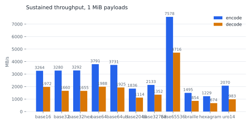
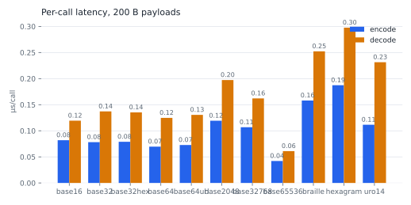

# radixly

## Support

- CPython 3.11+ only. radixly is a hand-written C extension and ships no
  pure-Python fallback.
- Subinterpreters are not supported: on Python 3.12+, importing radixly in a
  subinterpreter raises `ImportError`; on 3.11 the import cannot be refused
  and the behavior is undefined.

## Performance

radixly aims to be the fastest Python implementation of these codecs — and
measures that claim instead of asserting it. Everything below is generated
from the committed record run
([`benchmarks/results/i9-13900K-performance.json`](benchmarks/results/i9-13900K-performance.json))
via `python -m benchmarks --render-from benchmarks/results/i9-13900K-performance.json --inject README.md`;
no number here
is ever typed by hand. Sizes are per-call latency below 64 KiB and sustained
throughput at or above it; “vs reference” is the speedup over the pure-Python
oracle in `tests/reference/`, measured on the same machine in the same run.

<!-- radixly-bench:begin -->
*Measured on 13th Gen Intel(R) Core(TM) i9-13900K (performance governor), CachyOS, kernel 7.2.0-1-cachyos, CPython 3.13.14, gcc 16.2.1 20260810, radixly 0.1.0.dev0 @ 2181692 (dirty), 2026-08-29T16:01:16+00:00.*

| codec | direction | 1 B | 200 B | 64 KiB | 1 MiB | vs reference |
|---|---|---|---|---|---|---|
| base32768 | encode | 0.017 μs | 0.113 μs | 1,968 MB/s | 1,972 MB/s | 116x at 200 B |
| base32768 | decode | 0.015 μs | 0.201 μs | 1,138 MB/s | 1,140 MB/s | 106x at 200 B |
| braille | encode | 0.018 μs | 0.170 μs | 1,372 MB/s | 1,372 MB/s | 94x at 200 B |
| braille | decode | 0.015 μs | 0.275 μs | 784 MB/s | 784 MB/s | 72x at 200 B |
| hexagram | encode | 0.018 μs | 0.203 μs | 1,136 MB/s | 1,136 MB/s | 105x at 200 B |
| hexagram | decode | 0.016 μs | 0.324 μs | 659 MB/s | 659 MB/s | 82x at 200 B |
| uro14 | encode | 0.017 μs | 0.122 μs | 1,864 MB/s | 1,918 MB/s | 116x at 200 B |
| uro14 | decode | 0.015 μs | 0.182 μs | 1,010 MB/s | 1,079 MB/s | 116x at 200 B |
<!-- radixly-bench:end -->

<picture>
  <source media="(prefers-color-scheme: dark)" srcset="benchmarks/charts/throughput.dark.svg">
  
</picture>

<picture>
  <source media="(prefers-color-scheme: dark)" srcset="benchmarks/charts/latency.dark.svg">
  
</picture>

Per-codec size sweeps (throughput and latency across payload sizes) live in
[`benchmarks/charts/`](benchmarks/charts/), one folder per codec.

To reproduce: `uv run python -m benchmarks` from the repository root — the
suite refuses non-optimized builds, records its own environment (CPU,
governor, compiler, commit), and warns when call floors drift from the
committed baseline.
